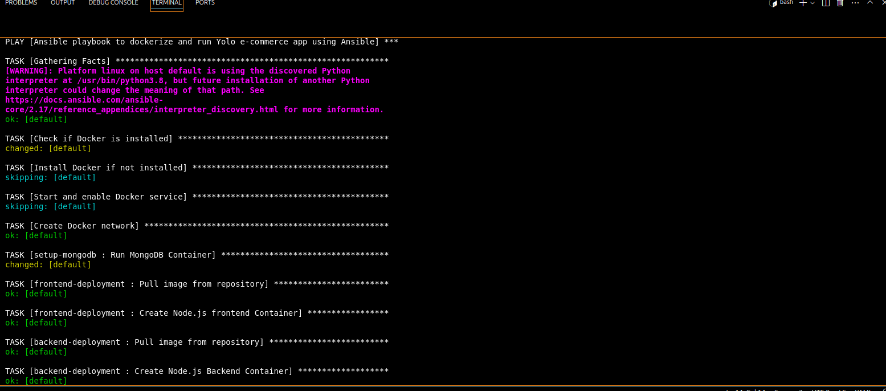
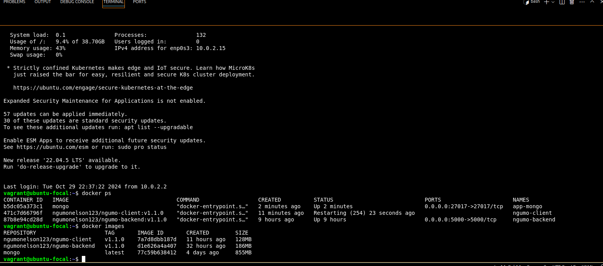
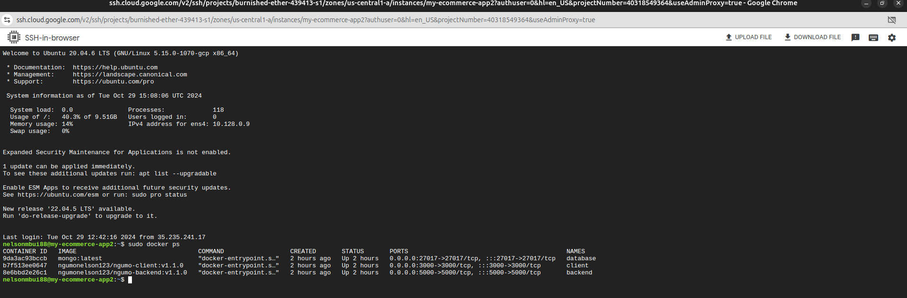

# YOLO Application Containerization and Deployment

This project involves the containerization and deployment of a full-stack YOLO application using **Docker** and **Terraform**. The application consists of a React frontend, a Node.js backend, and a MongoDB database.

## Overview

The application architecture includes:

- **Frontend**: A React application serving as the user interface, allowing users to interact with the application easily.
- **Backend**: A Node.js application handling API requests and business logic, providing a robust and scalable server-side environment.
- **Database**: A MongoDB database for data persistence, ensuring that user data and application states are stored and retrieved efficiently.

## Requirements

To run this application, you need to have the following installed:

- **Docker**: You can install it by following the instructions in the link below:
  - [Docker Installation Guide](https://docs.docker.com/engine/install/)
  
- **Vagrant**: For managing virtual machine environments.
  - [Vagrant Installation Guide](https://www.vagrantup.com/docs/installation)
  
- **VirtualBox**: As a provider for Vagrant.
  - [VirtualBox Installation Guide](https://www.virtualbox.org/wiki/Downloads)

- **Terraform**: Install Terraform from the official site:
  - [Terraform Installation Guide](https://www.terraform.io/downloads.html)

## How to Launch the Application










### Stage One: Launch Using Vagrant on VirtualBox

1. **Clone the Repository**

   Clone the repository to your local machine:

   ```bash
   git clone https://github.com/Ngumonelson123/yolo.git
   cd yolo
Launch the Vagrant Box

Use the following command to provision the virtual machine:

bash
Copy code
vagrant up --provision
This command will set up the environment and install the necessary dependencies on your VirtualBox.

Stage Two: Deploy Using Terraform on Google Cloud Platform
Change Directory to Terraform Configuration

Navigate to the directory containing your Terraform configuration files (e.g., terraform/).

bash
Copy code
cd terraform
Initialize Terraform

Run the following command to initialize Terraform:

bash
Copy code
terraform init
Validate Configuration

Check if your Terraform configuration files are valid:

bash
Copy code
terraform validate
Plan the Deployment

Create an execution plan to see what actions Terraform will take:

bash
Copy code
terraform plan
Apply the Configuration

Apply the changes required to reach the desired state of the configuration:

bash
Copy code
terraform apply
Accessing the Application
Once the application is up and running, you can access it via:

Frontend: http://34.41.172.14:3000
Backend: http://34.41.172.14:5000


Summary Notes for Docker Compose Setup
The docker-compose.yml file defines three main services:

1. Frontend (React)
Service Name: ngumo-client
Ports: Exposes port 3000 (http://34.41.172.14:3000)
Depends On: ngumo-backend (Backend service)
Build Context: Built from the ./client directory
2. Backend (Node.js)
Service Name: ngumo-backend
Ports: Exposes port 5000 (http://34.41.172.14:5000)
Depends On: app-ip-mongo (MongoDB service)
Build Context: Built from the ./backend directory
Restart Policy: Always restart on failure
3. MongoDB (Database)
Service Name: app-ip-mongo
Ports: Exposes port 27017
Volume: Uses app-mongo-data for persistent database storage
Networking
Custom Network: A custom bridge network named app-net is configured with the subnet 172.20.0.0/16.
Volumes
MongoDB Volume: app-mongo-data is used for persistent database storage.
Dockerfile Descriptions
Backend Dockerfile
Base Image: Uses Node 16 based on Alpine Linux.
Dependencies: Installs production dependencies and removes development files.
Port: Exposes port 4000.
Start Command: Runs the application using npm start.
Frontend Dockerfile (Multistage)
Build Stage: Builds the React app with production dependencies.
Production Stage: Copies build files from the build stage.
Port: Exposes port 3000 and starts the app using npm start.
Key Commands
Build and Run: docker-compose up --build
Stop Containers: docker-compose down
