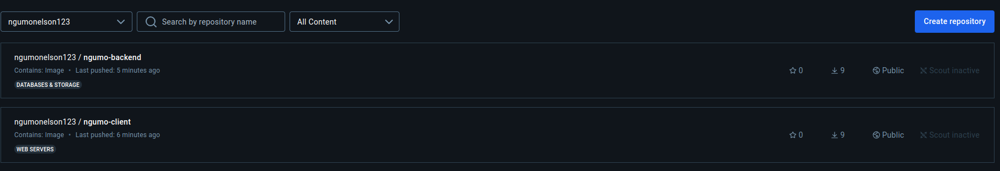

# Overview
This project involved the containerization and deployment of a full-stack yolo application using Docker.

# Requirements
Install the docker engine here:
- [Docker](https://docs.docker.com/engine/install/) 

## How to launch the application 

## How to run the app
## How to Launch the Application
##Ensure you have Docker installed, then follow these steps to start the application:

## Clone the repository:

bash
Copy code
git clone https://github.com/Ngumonelson123/yolo.git
cd yolo
Build the Docker image:

bash
Copy code
docker build -t yolo-app .
Run the Docker container:

bash
Copy code
docker run -d -p 80:80 yolo-ap
